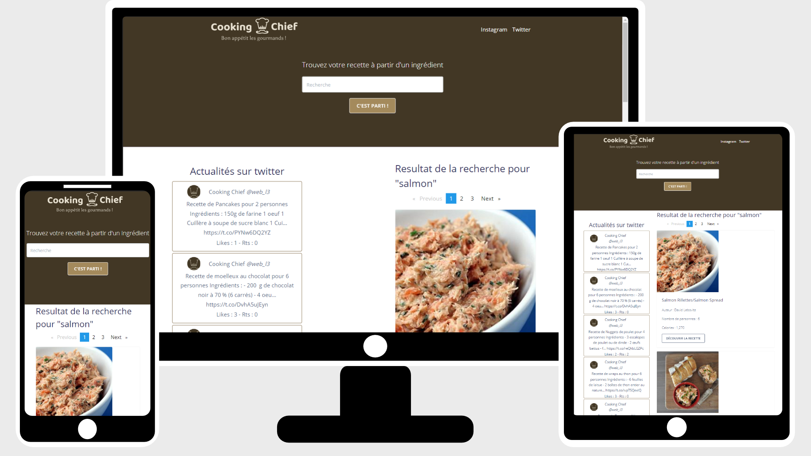

# Projet-web
Projet dans le cadre des modules d'IHM et d'Architectures logicielles pour le développement d'applications Web, de la 3ème année de Licence Informatique (Le Mans Université).

## Membres de l'équipe :
* ALLAIN Yannis
* CHAUMULON Cassandra
* DERRIEN Guillaume

## Objectifs :
Créer une application Web ayant les caractéristiques suivantes :
* single page application (SPA);
* utilisation d'API REST (type réseaux sociaux, météo, maps, jeux, ect.);
* les données fournies par les API doivent être au format JSON;
* développer une interface Client responsive ;

## Technologies utilisées :
* Pour le Front-end :
  * Angular 
  * Bootstrap
* Pour le Back-end :
  * Node.js
  * Framework Express
  * MongoDB  

## Suivi du projet :
→ Lien vers le [Trello](https://trello.com/invite/b/JF5x9ooX/80a29375174e14358e4d60f9d6823364/projet-web)

→ Lien vers la [Démonstration vidéo](https://drive.google.com/file/d/1WwSVAbY2005VtUvT3fj0h9Z5PZQSNjcV/view?usp=sharing)

→ Lien vers l'[Application](https://cassandrach.github.io/Cooking-Chief) (pas à jour)

## Etapes pour faire fonctionner l'application en local :

### :warning:  **Attention : Laissez tourner les 2 terminaux, sinon l'application ne fonctionnera pas :wink:**
----------

1. Cloner le répertoire.

2. Ouvrir un terminal.

3. Aller dans le dossier back-end.

4. Ecrire la commande :  ``npm start`` (lors de la première utilisation, si vous rencontrez une erreur : faites d'abord ``npm install`` puis ``npm start``).

5. Ouvrir un deuxième terminal.

6. Aller dans le dossier front-end.

7. Ecrire la commande : ``ng serve`` (lors de la première utilisation, si vous rencontrez une erreur : faites d'abord ``npm install`` puis ``ng serve``).

8. Ensuite, rendez-vous à l'adresse dans votre navigateur : http://localhost:4200/.
